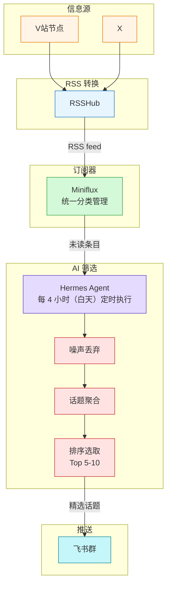

## 背景

我每天都会刷各种社区，主要看技术、AI等茧房内外都有的话题。但逛的时间越长，越觉得累--不是内容不够好，是噪音太多了。

例如 V 站的节点机制本来是想让你只看感兴趣的内容，但实际用下来，即使只订阅了技术节点，信息流里依然混着大量闲聊、重复话题、招聘帖和二手交易。想找有价值的技术讨论，得在噪音里捞针。

社区里隔三差五就有人吐槽这件事，但噪音是结构性的：人多了，水帖就多了。但社区本来就是求同存异的，这也无可厚非，所以与其等社区自我净化，不如让 AI 帮我筛。

## 效果展示

## 核心流程

我的思路是把社区平台当作 RSS 源接入订阅器，再用 AI 做二次筛选，只推送真正值得看的内容。

## 筛选逻辑

AI 筛选不是简单做关键词过滤。我把它分成了三层。

### 第一层：噪声丢弃

明确丢弃的内容类型，不论是否匹配兴趣：

- 纯转发/分享，无附加评论
- 日常生活、心情、情绪宣泄
- 梗图、玩笑，无技术实质内容
- 招聘、二手交易、水帖
- 推广/商业内容

原则是宁少勿多--不确定的时候倾向丢弃。

### 第二层：话题聚合

同一个事件，X 上有人讨论，V 站 上也有人在聊，自动合并成一个话题。这避免同一个热点重复出现，也让跨平台的信息能互相补充。

### 第三层：排序选取

按价值排序取 Top 5-10：新发布/重大变更 > 多人讨论的热点 > 教程/可操作内容 > 一般性观点。不足 5 个就少推，不用低价值内容凑数。

你也可以加入自己感兴趣的话题，进行重点关注，还可以额外加入「对自己有什么用」模块。

## 闲聊噪音模块

完全丢弃噪音会有一个问题：失去对社区整体氛围的感知。万一某天大家都在聊一个我没关注到的热点呢？

我在推送末尾加了一个「闲聊噪音」模块：

> 处理 42 篇 -> 聚合为 12 个话题 -> 保留 6 个
>
> **闲聊噪音**
>
>
> 主要是周末感想 + 几条对某框架的吐槽 + 3 条梗图。整体氛围轻松，无新工具/技术信号。（过滤 30 条）
>
>

不附原始链接（噪音就是噪音），不逐条列举，只概括主题分布和过滤条数。这样既不增加阅读负担，又能知道"今天丢了多少，丢的是什么类型"。

## 没有内容的时候

当预筛后 0 条信号，或者聚合后 0 个有价值话题时，任务静默退出，不推送任何消息。连"今日无新内容"都不发。

"没有值得看的"本身就是一种信号--说明今天社区比较平淡，可以放心去干别的事。

## 不止 V 站

因为是基于 RSS 的，只要 RSSHub 能转成 RSS 的平台都能接进来。X、少数派、虎扑，统一处理，跨平台同话题自动合并。

同一个技术事件，X 上的英文讨论和 V 站 上的中文讨论会被聚合成一个话题，两边的信息互相补充。

## AI 不帮你思考，只帮你筛选

这不是"AI 替我读社区资讯"。AI 做的是初筛，把 40 条未读砍到 6 条值得看的，最终还是我来决定要不要点进去看。

但这个初筛的价值很大。每天省下来的不是几分钟，而是注意力：不用在噪音里消耗判断力，打开推送看到的就是信号。

