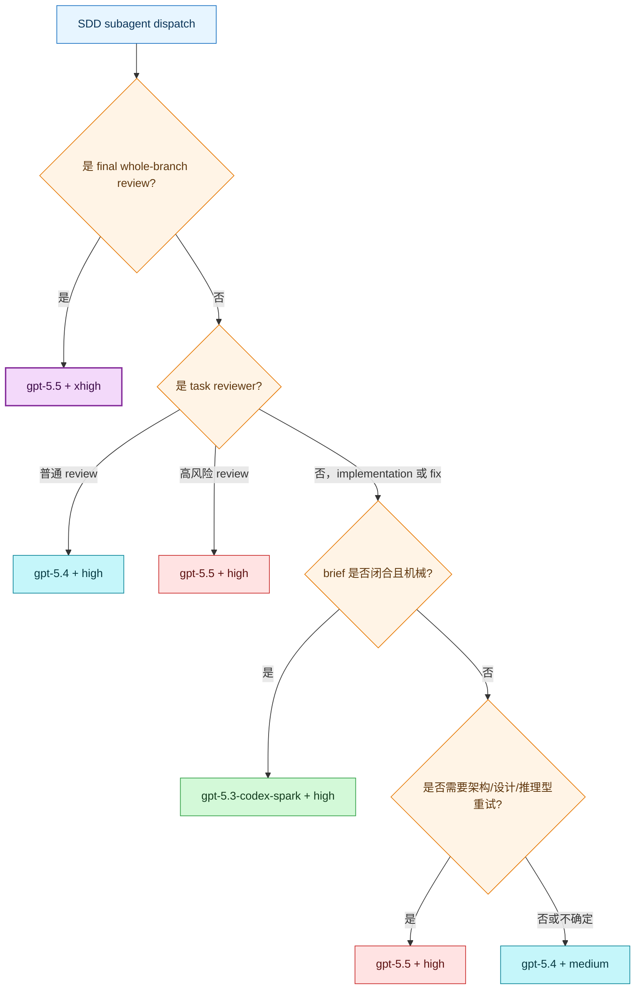

## 背景


我使用 GPT Plus 时，一直用的 [Codex 架构/方案设计 + GLM 5.2 执行](https://blog.1874.cool/codex-claude-code) 这套工作流，但基本也是 2-3 天周额度就用完了，有时候不得不全程 GLM 5.2 来开发。


后来升级到 Pro 5x 之后几乎全程 5.5 high/xhigh，一开始因为官方会送重置，我用着还没感觉，额度还挺充足。但是最近发现 Pro 5x 也不怎么够用了，3-4 天就能用完周额度，最近也是用了一次重置卡才缓解。


所以我又开始折腾如何优化 Codex 的使用，能尽量物尽其用的同时保证不用为额度焦虑。


## Superpowers 的困境与翻盘


### Superpowers 的缺陷


我很早就开始使用 [Superpowers](https://github.com/obra/superpowers)了，我很多需求和讨论都是靠他来实现的。而且我很欣赏它的工作流，他的 Brainstorming 和一系列的全自动工作流能很好帮助我从 0 到 1 理清需求和完成代码开发。


但是它的缺陷也很明显：

1. 会经常自动触发 Brainstorming 等 Skill 来回答问题，即便是一些很小的问题。一开始觉得还挺好，能帮我拓展我的想法，帮我发现一些潜在的问题。但最近发现，大部分情况直接和 Codex 对话其实就够了。
2. 小修小改的时候时会经常自动调用 Superpowers TDD Skill 来写很多防御性代码，即使任务目标已经很明确了，但还是防不住。

而且以上两个问题都存在一个共通问题：太太太太费 Token 了，随便一个全流程任务，Token 的消耗是很惊人的，我之前的额度消耗很大程度都是和它有关。


### matt-pocock-skills


于是在社区佬的帮助下，又找到一个 [mattpocock/skills](https://github.com/mattpocock/skills)，纵观它的整个工作流，和 Superpowers 其实没有太大区别：


| Superpowers                                       | Matt Pocock 近似替代                 | 什么时候用                  |
| ------------------------------------------------- | -------------------------------- | ---------------------- |
| `using-superpowers`                               | `/ask-matt`                      | 不确定该用哪个流程              |
| `brainstorming`                                   | `/grill-with-docs` 或 `/grill-me` | 需求还模糊，需要先打磨            |
| `writing-plans`                                   | `/to-prd` -> `/to-issues`        | 大需求要变成 PRD 和可分配 issues |
| `test-driven-development`                         | `/tdd`                           | 明确要 test-first 或锁住关键行为 |
| `systematic-debugging`                            | `/diagnosing-bugs`               | 难 bug、回归、性能问题、复现不清     |
| `executing-plans` / `subagent-driven-development` | `/implement`                     | 根据 PRD 或 issue 开始实现    |
| `requesting-code-review`                          | `/code-review`                   | review diff、分支、PR、WIP  |
| `verification-before-completion`                  | 直接跑最小验证命令                        | 完成前验证测试、构建或关键流程        |
| `finishing-a-development-branch`                  | 手动 Git / PR 收尾                   | 合并、推送、开 PR、保留分支        |


它同样也具备从 0 到 1 或大需求的工作流：

1. `/grill-with-docs`对你的想法进行七七四十九问，确认共识。
2. `/to-prd` 将共识落实成 PRD 文档。
3. `/to-issues`将共识拆解为不同的的 issue 任务。
4. `/implement`自动按照 tdd 模式，对照 issue 任务进行开发，并进行 code review。

一些其他 skill 也比较好用，特别是`/handoff`，很适合在上下文快慢了，害怕自动压缩时丢失太多细节，想单独开会话继续聊。


| 入口          | 用途                     |
| ----------- | ---------------------- |
| `/ask-matt` | 路由器：不知道该用哪个 skill 时先问它 |
| `/grill-me` | 想把一个想法或计划拷问清楚          |
| `/handoff`  | 上下文太大，或要换新 session 继续  |
| `/research` | 需要基于一手来源做技术调研          |
| `/teach`    | 想系统学一个概念               |


### Skill 对比


整体对比 `mattpocock/skills` 和 Superpowers 的话，我体验下来有3个最大的不同点：

1. `mattpocock/skills` 基本上不会自动触发相关 skill，基本上都是手动调用，需要时间适应，但可控的手动调用我更喜欢一些。而 Superpowers 经常自动调用，这对于新手非常友好，可以不用关心流程，但是用熟之后就有点费 Token / 时间了。
2. `mattpocock/skills` 的`/to-issues`没有具体代码示例和详细步骤，主要是规定了开发目标和验收标准，模型在执行时会相对自由发挥一些。而 Superpowers 的 `writing-plans` 给出的实施计划有非常详细的代码示例骨架和步骤，brief 非常明确，基本上让模型照着执行就行。这也是我之前使用 GLM 5.2 来执行实施计划不怎么出问题的关键原因。
3. `mattpocock/skills` 在使用`/implement`进行开发时，一般不会主动派遣子代理进行开发，而是建议每个 issue 都单独开新会话来完成。而 Superpowers 是一次性开发完所有 Task，并对每个 Task 和 Review 都用子代理来完成，主线程只用于把控流程。

### Superpowers 小翻身


**mattpocock/skills**


我各自使用了一段时间，一开始的决定是放弃  Superpowers  ，全面拥抱手动触发的`mattpocock/skills`。但用了几天之后发现，`mattpocock/skills`并不一定适合我的所有场景，特别是进行较大需求或者从 0 到 1 时，它不一定比 Superpowers 更准确和省 Token。


`mattpocock/skills` 的`/to-issues`没有具体代码示例和详细步骤。所以在每个 issue 实现阶段，都需要模型重新分析现有代码和文档才开始执行。


而且因为新会话如果只处理一个 issues，代码开发、tdd、code review 都在同一个会话完成，所以没办法细分一些低等级模型来完成一些简单任务，需要一开始就决定完成该 issue 的模型和思考程度。


我使用几天后发现，生成的单独 issue 基本只有语义化的实现方案和验收标准，我实测的两个需求都会漏一些任务，而它自己 `review` 时，由于共享的同一个上下文，不一定会找出这个问题，所以实际我更不敢一开始把这些任务交给 GPT 5.4 甚至更低的模型来完成。


所以`mattpocock/skills`在完成一个完整需求时，整体 Token 消耗可能会更高。


**Superpowers**


而 Superpowers 的实施计划中的 Task 任务，很多时候是不需要模型主动思考的，大部分都是机械化的执行，只有一少部分是需要理解代码再行动的，所以实施计划甚至可以交给 GPT 5.4/GLM/DeepSeek V4 去完成也不会出太大问题。而且 Superpowers 使用子代理来审查会更客观一些。 


Superpowers 在指定子代理的时候也有对模型有一套完整的模型选择方案，可以针对不同任务创建不同模型的子代理，这样就可以把一些简单任务交给更便宜的模型来执行。


## 基于 Superpowers 的省 Token 方案


虽然 Superpowers 内置的 `subagent-driven-development`有一套完整的模型选择方案，用来告诉 AI Agent 在不同情况下选择什么样的模型来执行任务。


但由于 Superpowers 并不是 Codex 专属 Skill，它需要同时服务多个 AI Agent， 所以在指定模型时，它的用词都比较通用：`cheapest models`、`standard model`、`most capable model`。而实际 AI Agent 在分配子代理模型时，大多时候都比较模糊，并不一定控制的非常精确。而这也是我要优化用来省 Token 的关键点。


再加上 ChatGPT Pro 会送一个 [gpt-5.3-codex-spark](https://openai.com/zh-Hans-CN/index/introducing-gpt-5-3-codex-spark/) 的单独计费额度，也是同样有 5 小时额度和周额度，和正常的额度是分开计算的。我让 Codex 分析我过往一些 Superpowers 生成的实施计划，给出的答案很惊人：几乎 60-70% 的 Task 都可以用`gpt-5.3-codex-spark`来完成。这些 Task 都有一些共通点：

- brief 写清了目标文件。
- brief 给出了具体测试代码。
- brief 写明了预期 RED/GREEN 行为。
- 接口、函数名、参数、返回值明确。
- 有代码级步骤、实现骨架，或足够具体的迁移路径。
- worker 主要是在转写、接线、跑测试、修小错。

而这正是`gpt-5.3-codex-spark`的优势所在，这些代码实现并不需要多强的推理，而且他还是单独计算额度，再合适不过了。


### 1. 全局 Agent.md 规则压制


由于 Superpowers 的自动触发实在是比较费 Token 和过于防御性开发。如果我只想手动调用它，并且让 `mattpocock/skills` 和 Superpowers 共存的话，目前一个比较有用的做法是在 Codex 的全局 AGENTS.md 抑制 Superpowers 的自动触发，效果非常显著。


```markdown
## Superpowers 规则

Superpowers 相关 Skill 不是默认工作流。除非我显式触发，或当前已经在 Superpowers 流程中，否则不要主动调用 Superpowers 相关 Skill
```


### 2. Superpowers SKILL 改造


就是因为 Superpowers 本身对于模型的分配比较模糊，所以我改造了它的 `subagent-driven-development`相关 skill，能专门针对 Codex 来指定子代理的模型，从而使用具体的模型来进行分配不同的任务。


我 [fork 了官方的仓库](https://github.com/LetTTGACO/superpowers/tree/codex)，新建了 `codex` 分支，做了如下改造：

1. 重写/补强`subagent-driven-development`的 `Model Selection`模块，加入三档 tier、Codex 映射、plan 详细度判断、final reviewer 固定 `5.5 xhigh`。
2. 在子代理创建模板中指定 `reasoning_effort`推理程度。
3. 在`requesting-code-review`的 subagent 创建模板中指定使用`5.5 xhigh`来 review。

### 3. 决策树





## 延展


随着国产模型的崛起，我感觉这个流程中的很多模型其实用 GLM/DeepSeek 来实现，但奈何我目前没有找到一个相对比较简单稳定的跨模型/Agent方案来实现，所以只能先全程用 Codex 来完成。如果未来可以实现，那对我来说会是一个非常大的提升。

