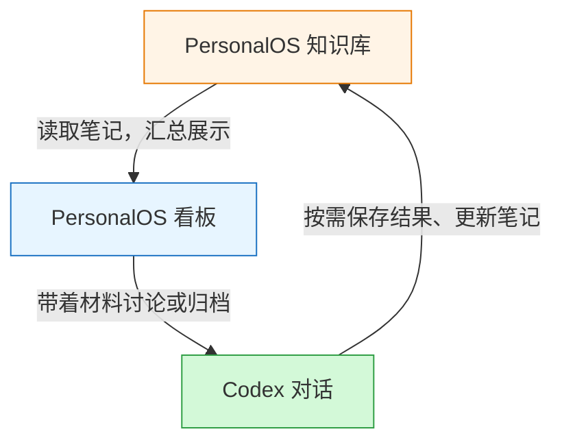

## 背景

OpenAI 最近推出了 [Plugin Extensions](https://developers.openai.com/plugins/build/extensions)，可以让开发者能够将插件整合到 ChatGPT 侧边栏、创作界面以及文件查看器中。感觉 Codex 的可玩性就变高了，开发的插件可以利用 ChatGPT 原生 Agent 能力，复刻一些市面上各种集成 AI 的 APP，或者开发一些属于自己工作流的插件，将 Codex 变成一个超级 APP。

例如直接把独立开发三剑客：记账、日记、TODO 又搬到 Codex 中哈哈哈哈。

## 个人尝试

我自己是有一套 AI 优先的基于 Obsidain 的 PersonalOS 知识库，但一直有一些痛点/痒点：

1. 缺少整个知识库的看板功能，没办法从全局视角来看我的 TODO、项目和调研进度。
2. 很多文档都需要和 Codex 进一步讨论和归档，之前是粘贴文档路径来和 Codex 讨论。

之前是想把这个看板做成 Obsidain 插件的，刚好这次直接做到 Codex 中，还能利用 Codex 原生的 Agent 能力做一些事情。

我花了 1 天时间，改了好几版之后，算是有了一个可用的版本，后续慢慢体验和优化吧。

## PersonalOS 看板插件

### 架构和数据流

整体架构很简单，Obsidain 的 Markdown 文档是我的唯一数据来源，这个看板只做汇总和进一步的交互体验。

### UI 展示

插件可以直接设置为全局侧边栏，方便打开，也可以同时设置为在聊天侧栏中打开。

> UI 相对比较常规，ChatGPT 的 UI 设计，以及我本身的 UI 审美和设计都很一般，能用就行 Orz

### 踩坑点

1. 如果从插件发起的 Codex 聊天，会自动弹窗确认，无法直接发起无感聊天。
2. 无法从插件直接发起新聊天到某个项目中，但是可以在 Codex 聊天中发起新聊天到项目中。我的解决办法就是给 Prompt 指定项目的入口，让中转聊天创建项目聊天，然后自动归档中转会话。
3. 目前无法直接在插件中调用 Agent 运行，所以就无法做一些自动化操作，例如自动总结啥的，只能手动运行。

