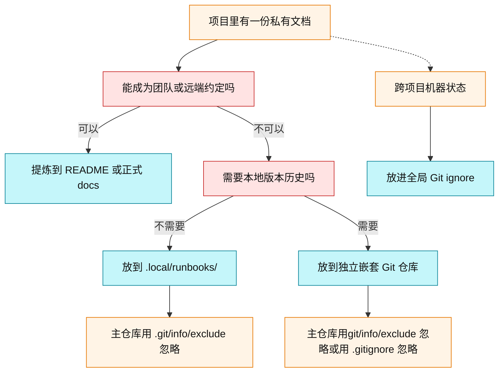

## 背景


我最近在用 Vibe Coding 参与开源项目或者个人项目的开发过程中，发现有很多让我头疼的文档和`gitignore` 忽略问题：


### 本地私有文件


我经常使用 JetBrains 系列的 IDE 来进行开发和 Git 相关的操作。但是他默认生成的`.idea/`文件在很多开源项目都没有默认进 gitignore 文件，导致我古法编程或者 Vibe Coding时都需要考虑这个文件的忽略提交。


我之前一般是添加它到项目本身的 gitignore，代价就是会产生 git 提交记录，还可能会产生仓库 diff、影响其他协作者。


### 本地私有部署文档


就像我的这篇博客文章中提到的一样： [无需打散件补丁：用 fork 接管 Hermes 更新](https://blog.1874.cool/hermes-update-fork)


我基于官方的开源项目做的私有改动但又不想提 PR 到官方项目时，就会产生有一些

> 适合保存当前机器、当前项目的操作手册，例如发版流程、服务器镜像更新步骤、SSH alias、路径、端口和其他不适合公开的部署细节。

我需要在部署的时候需要让 AI Agent 去读取这些流程文档帮我部署。


### AI Agent 产生的中间文档


我经常使用的 superpowers 插件，它会产生 `docs/superpowers/plans`  `docs/superpowers/specs` 等方案文档。如果不想提交到代码仓库，特别是开源项目都会忽略这些文档。


但是这些文档我又需要审阅和修改、Git 历史、diff、回滚和本地提交，把他们当做本地版本化文档


以上这些文档该怎么本地管理呢？我探索之后终于找到一个好用的解决方案。


## Git 忽略/排除规则


Git 其实天然支持本地项目的忽略和排除，不会污染项目本身的 gitignore 和 git 提交记录。


### 策略一：本地私有 Runbook


适合保存当前机器、当前项目的操作手册，例如发版流程、服务器镜像更新步骤、SSH alias、路径、端口和其他不适合公开的部署细节。


```plain text
.local/
  runbooks/
    release.md
```


然后把 `.local/` 加到当前 clone 的本地忽略文件：


```bash
printf "\n# Local private runbooks\n.local/\n" >> .git/info/exclude
```


这样文件仍然和项目放在一起，使用时上下文最清楚，但不会进入 Git 提交，也不会推送到远端仓库。


例如我个人的 Hermes 开发/更新流程的本地文档，后续直接让 AI Agent 读这份文档进行日常开发上线或者更新我的线上 Hermes：


```markdown
# Hermes 个人分支运作约定

这份仓库的 `main` 是个人自用主线，叠在官方 `NousResearch/hermes-agent` 之上，不回流上游。

参考背景：[无需打散件补丁：用 fork 接管 Hermes 更新](https://blog.1874.cool/hermes-update-fork/)

## 仓库关系

- `origin` 指向个人 fork：`LetTTGACO/hermes-agent`。
- `upstream` 指向官方仓库：`NousResearch/hermes-agent`。
- 服务器部署在 `homelab:/usr/local/lib/hermes-agent`。
- 服务器部署目录的 `origin` 指向个人 fork，执行 `hermes update` 会直接拉 fork 的 `main`。

## 日常开发上线

### 本地：测试相关改动
python -m pytest tests/gateway/test_feishu.py tests/plugins/platforms/feishu/ -q

### 本地：提交并推到个人 fork
git add -A
git commit -m "fix(feishu): ..."
git push origin main

### 服务器：从 fork 拉 main，并走 Hermes 自带更新流程
ssh homelab 'hermes update'

`hermes update` 会继续执行 Hermes 自带的快照、pull、语法校验、回滚保护、清 bytecode、依赖重装、迁移和网关重启流程。

## 同步官方更新

git fetch upstream
git merge upstream/main
git push origin main
ssh homelab 'hermes update'

自用场景默认用 merge，不默认 rebase 或 force push。

## 查看上游更新

当用户问“上游升级了什么”“官方更新了什么”或类似问题时，默认语义是：

- 以个人 fork 的 `origin/main` 作为当前已发布自用主线。
- 对比官方 `upstream/main`，只总结官方上游相对个人 fork 新增、修复或重构了什么。
- 不需要主动汇总个人分支已有改动；这些改动默认用户已知。
- 只有当用户明确问“我的改动”“个人分支改了什么”“我这边和上游差什么”时，才整理个人分支相对上游的改动。

## 回滚

### 查看服务器更新历史
ssh homelab 'cd /usr/local/lib/hermes-agent && git reflog'

### 回滚服务器到某个已知 commit
ssh homelab 'cd /usr/local/lib/hermes-agent && git reset --hard <commit> && hermes gateway restart'

## 操作禁忌

- 不要默认 rebase。
- 不要默认 force push。
- 不要默认 reset 或清理个人改动。
- 不要把个人分支改动当成上游贡献前的临时补丁。
- 不要回到手工 scp 文件到服务器的旧流程。
```


当然这种方式的缺点是没有版本历史。如果手册内容需要长期演化、对比、回滚，应该考虑策略二。


### 策略二：本地版本化文档仓库


如果某类本地文档不适合推到主仓库远端，但又需要 Git 历史、diff、回滚和本地提交，可以在被主仓库忽略的目录里再初始化一个独立 Git 仓库。


```plain text
project/
  docs/
    superpowers/
      .git/
      specs/
      plans/
```


主仓库通过 `.git/info/exclude` 忽略整个本地文档目录：


```bash
printf "\n# Local versioned superpowers docs\ndocs/superpowers/\n" >> .git/info/exclude
```


如果主仓库已经跟踪了这些文件，可以先让主仓库停止跟踪，但保留本地文件：


```bash
git rm -r --cached docs/superpowers
git commit -m "chore: stop tracking local superpowers docs"
```


然后在本地文档目录里初始化自己的 Git：


```bash
cd docs/superpowers
git init -b main
git add .
git commit -m "init local superpowers docs"
```


这个做法的边界：

- 主仓库的 `.git/info/exclude` 只影响主仓库，不影响 `docs/superpowers/` 里面自己的 Git。
- 在主仓库根目录运行 `git status`，不会显示 `docs/superpowers/` 里的未提交改动。
- 要查看或提交本地文档变化，需要进入 `docs/superpowers/` 自己运行 `git status`、`git add` 和 `git commit`。
- 如果不给 `docs/superpowers/` 配置 remote，它就只保留在本机，不会被推送到远端。

### 全局 Git ignore


如果要忽略的是跨项目都一样的机器本地状态，像我常见的

1. JetBrains 产生的 `.idea/`
2. superpowers 产生的 SDD 临时文件 `.superpowers/`

这些几乎在所有项目都可能存在的文件，更适合放进全局 Git ignore，而不是写进每个仓库的 `.gitignore` 或 `.git/info/exclude`。


```bash
touch ~/.gitignore_global
git config --global core.excludesfile ~/.gitignore_global
printf "\n# JetBrains IDE state\n.idea/\n" >> ~/.gitignore_global
```


### 注意事项

- `.git/info/exclude` 只对当前 clone 生效；换机器或重新 clone 后需要重新配置。
- 全局 Git ignore 只影响当前系统用户；换机器后需要重新配置一次。
- 不要在私人 runbook 里保存明文密码、长期有效 token 或不可轮换凭据。
- 如果某些流程后来变成团队共识，再把通用部分提炼进 README、[AGENTS.md](http://agents.md/) 或正式 docs。
- 私有部署路径、SSH alias、服务器名、容器名等仍留在 `.local/runbooks/`。
- 嵌套 Git 仓库默认没有 remote；如果以后要备份，可以单独配置私有 remote。

## 决策图




